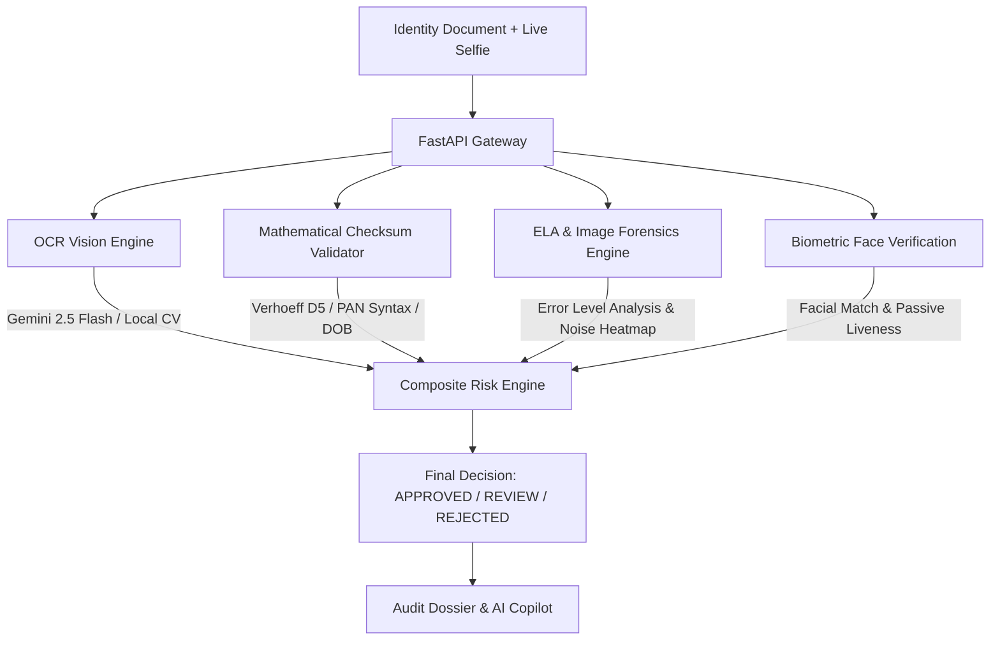

# TrustLens AI — Automated Document Screening & Biometric Fraud Detection

> **Smart India Hackathon (SIH) Edition**  
> An enterprise-grade, multi-modal AI platform for automated identity document inspection, Error Level Analysis (ELA) tampering forensics, mathematical checksum verification, and live facial biometrics.

---

## 🌟 Key Capabilities & Architecture

TrustLens AI integrates four distinct forensic pillars to evaluate identity documents with zero trust:



### 1. Optical Character Recognition (OCR)
- **Gemini 2.5 Flash Vision**: State-of-the-art multimodal extraction of Indian ID documents (Aadhaar, PAN, Passport, Voter ID, Driving License).
- **Graceful Local Fallback**: Built-in computer vision pre-processing (CLAHE, Otsu thresholding), QR/barcode decoding, and regex pattern matching.

### 2. Mathematical Checksum & Structural Validation
- **Aadhaar Verhoeff Dihedral D5 Algorithm**: Validates the mathematical authenticity of 12-digit UIDAI numbers. Any fabricated or altered number fails the dihedral checksum immediately.
- **PAN Card Structural Rules**: Enforces 10-character syntax (`[A-Z]{3}[PCHFATBLJG][A-Z][0-9]{4}[A-Z]`), verifies 4th character entity type (`P` = Individual), and cross-matches the 5th character with the cardholder's surname initial.
- **DOB & Name Matching**: Date calendar consistency, reasonable age calculation, and Levenshtein token similarity against claimed applicant identity.

### 3. Digital Tampering & Forgery Forensics
- **Error Level Analysis (ELA)**: Recompresses document images at uniform JPEG quality to expose differences in compression levels. Modified or spliced text boxes (e.g. photoshopped DOB or name) fluoresce as high-error anomalies.
- **Colorized Forensic Heatmaps**: Generates JET colormap heatmaps for visual inspection by KYC officers.
- **Noise Variance & Splicing Detection**: Local Laplacian variance analysis to detect artificially smooth MS Paint or Canva text overlays.
- **EXIF Forensics**: Detects metadata traces of software editors ("Photoshop", "GIMP", "Canva", "Paint.NET").

### 4. Biometric Face Verification & Anti-Spoofing
- **Facial Photo Extraction**: Automatically isolates and normalizes the portrait photo on the document.
- **Biometric Matching**: Multi-metric biometric fusion (HSV color distribution, Normalized Cross-Correlation, and structural contours) against live webcam selfie.
- **Passive Liveness / Anti-Spoofing**: 2D FFT frequency spectrum analysis to flag screen moiré patterns (photo taken of a monitor or smartphone screen) and Laplacian blur.

### 5. Interactive AI Copilot
- Context-aware chatbot powered by Gemini Flash that explains why documents were flagged, guides manual review officers, and explains cryptographic checksums.

---

## 🚀 Quick Start Guide

### Prerequisites
- Python 3.10+
- Modern Web Browser (Chrome, Edge, Firefox)

### 1. Clone & Enter Directory
```bash
cd AI_Document_Screening
```

### 2. Configure Environment Variables
Create or verify `.env`:
```env
PORT=8000
HOST=0.0.0.0
ENVIRONMENT=development
GEMINI_API_KEY=your_gemini_api_key_here
```

### 3. Install Dependencies
```bash
pip install -r backend/requirements.txt
```

### 4. Start the Application Server
```bash
python backend/main.py
```
Or with uvicorn:
```bash
uvicorn backend.main:app --host 0.0.0.0 --port 8000 --reload
```

### 5. Open Web Dashboard
Navigate to:
```
http://localhost:8000
```

---

## 🧪 Testing with Pre-loaded Sample Documents

The system comes with synthesized test documents in `data/`:
1. **Authentic Aadhaar Card** (`sample_valid_aadhaar.png`): Passes Verhoeff checksum (`5482 9103 8476`), uniform ELA, Low Risk (**APPROVED**).
2. **Tampered PAN Card** (`sample_tampered_pan.png`): Spliced DOB patch, altered font, high ELA error peak, Photoshop metadata (**REJECTED**).
3. **Republic of India Passport** (`sample_passport.png`): ICAO MRZ machine-readable zone layout.
4. **Live Selfie** (`sample_selfie.png`): Matches portrait photo for biometric testing.

You can click any of the **Quick Demo Presets** directly at the top of the web UI!

---

## 📡 API Endpoints

| Method | Endpoint | Description |
|---|---|---|
| `GET` | `/` | Serves the web dashboard |
| `GET` | `/api/health` | Service health & AI engine status |
| `POST` | `/api/screen` | End-to-end multi-modal document & biometric screening |
| `POST` | `/api/tamper-analysis` | Standalone ELA and forensic heatmap generation |
| `POST` | `/api/face-match` | Biometric face comparison and liveness check |
| `POST` | `/api/chat` | AI Compliance Copilot chat endpoint |
| `GET` | `/api/samples` | List preloaded sample test documents |
| `GET` | `/api/samples/{filename}` | Retrieve sample document image |
